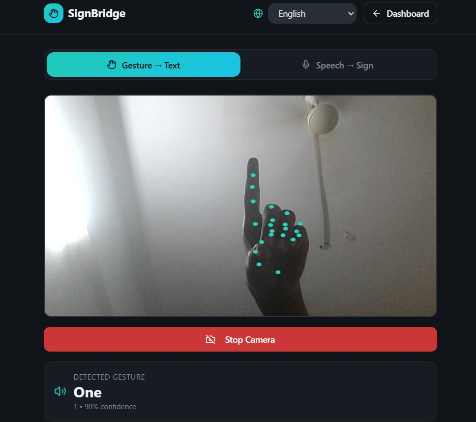
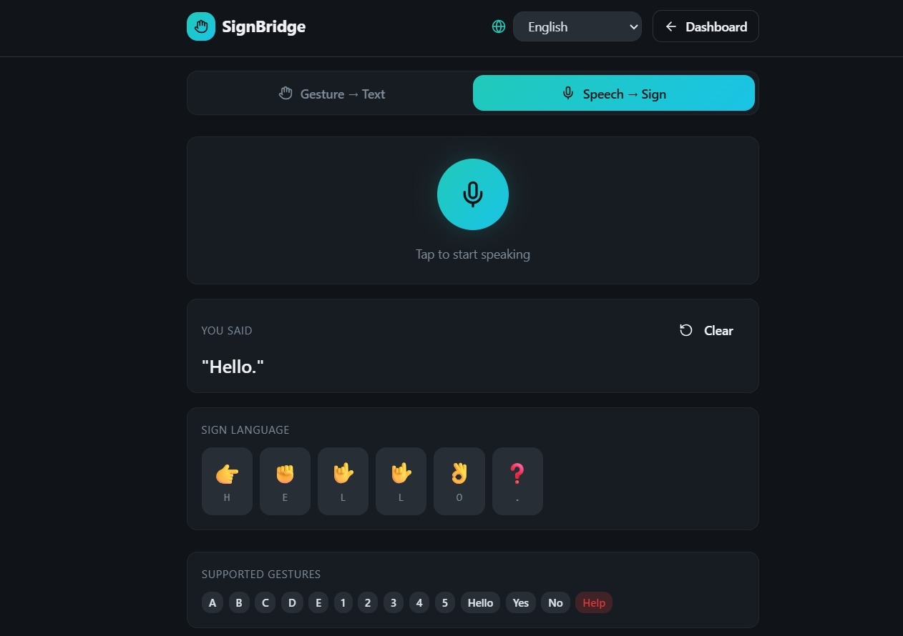
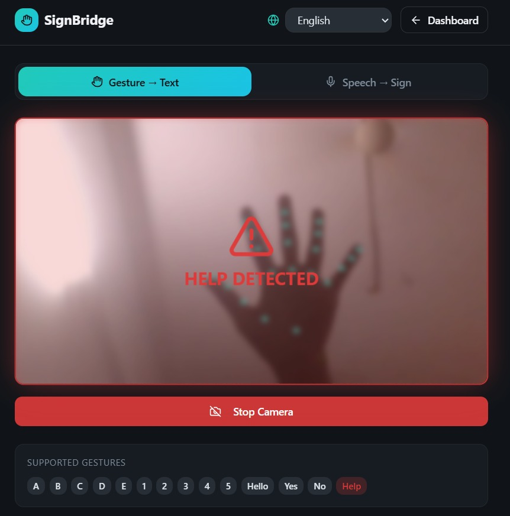

# Welcome to my your project
git 
# Sign Language Translator
A real-time Sign Language Translator that uses a webcam to detect hand gestures and convert them into text and speech.

## Features
- Real-time gesture detection
- Hand tracking using MediaPipe
- Gesture recognition using TensorFlow.js
- Speech output using Web Speech API

## Tech Stack
- React.js
- Tailwind.CSS
- MediaPipe
- TensoeFlow.js
- Python 

## Setup
1. Clone the repo:
   git clone https://github.com/KKaruna25/sign-language-translator.git 
2. Install dependencies:
   npm install
3. Run the project:
   npm run dev

## Screenshots
### Sign to Text

This feature detects hand gestures in real time and converts them into readable text.
It helps bridge communication for users who relay on sign language.

### Speech to Sign

This module converts spoken words into corresponding sign representations.
It enables two-way communication between speech users and sign language users.

### Help Gesture Feature

This unique feature detects a predefined "help" gesture and triggers an alert.
It can be used in emergency situations where verbal communication is not possible, making the system more impactful and practical.

## Author
Karuna
